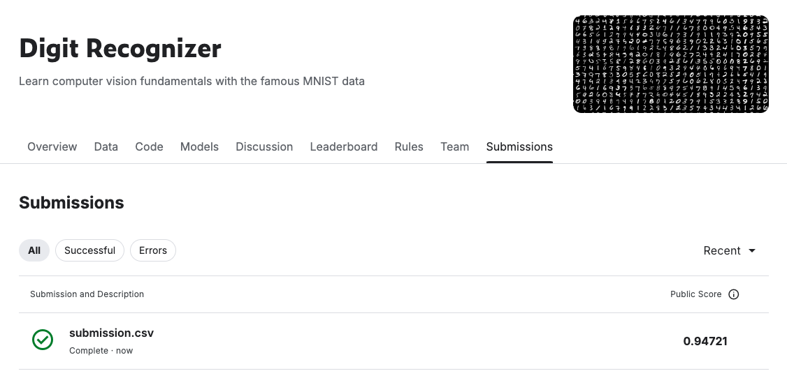

# 🧠 mnist-digit-recognition

Решение задачи распознавания рукописных цифр с использованием датасета **MNIST**  
(соревнование [Kaggle Digit Recognizer](https://www.kaggle.com/c/digit-recognizer)).

---

## 📌 Описание проекта

- 📂 Формат: CSV (784 признака-пикселя на изображение)
- 🧮 Метод: извлечение признаков **HOG (Histogram of Oriented Gradients)**
- ⚙️ Модель: **логистическая регрессия**
- ❌ Без использования сверточных нейросетей (CNN)
- 🎯 Цель: добиться accuracy > 0.6 (фактически: **94.7%**)

---

## 🏆 Результат на Kaggle

Финальный результат после отправки предсказаний:



**Public Score: 0.94721**

---

## 📁 Структура проекта

| Файл                          | Описание                                                        |
|-------------------------------|-----------------------------------------------------------------|
| `mnist-digit-classifier.zip`  | Архив с ноутбуком (`.ipynb`) для открытия в Google Colab        |
| `submission.csv`              | Предсказания модели для отправки на Kaggle                      |
| `kaggle_result.png`           | Скриншот результата с сайта соревнования                        |

❗ **Файлы `train.csv` и `test.csv` не включены в репозиторий** — см. раздел ниже.

---

## 📥 Загрузка данных

Оригинальные файлы можно скачать по прямым ссылкам:

- [`train.csv`](https://raw.githubusercontent.com/wehrley/Kaggle-Digit-Recognizer/master/train.csv)
- [`test.csv`](https://raw.githubusercontent.com/wehrley/Kaggle-Digit-Recognizer/master/test.csv)

Или вручную с официальной страницы соревнования:  
👉 [Kaggle Digit Recognizer – Data](https://www.kaggle.com/c/digit-recognizer/data)

В Colab файлы загружаются через:

```python
from google.colab import files
files.upload()  # выберите train.csv и test.csv


---

## 📚 Зависимости

```bash
pip install pandas numpy matplotlib seaborn scikit-learn scikit-image tqdm


